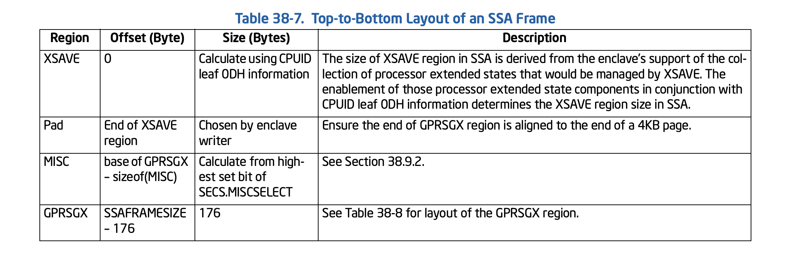

# SGX SSA 

可以看一看 sgx-step、openenclave 关于这部分的代码。

Intel 手册也有这部分的描述 "STATE SAVE AREA (SSA) FRAME"


## State Save Area (SSA) Frame 

When an AEX occurs while running in an enclave, the context (namely cpu register values) is saved in the **thread's current SSA frame**, which is pointed to by **TCS.CSSA** (CSSA). 

值得注意的是 OSSA，根据 [Intel手册](https://www.intel.com/content/dam/www/public/us/en/documents/manuals/64-ia-32-architectures-software-developer-vol-3d-part-4-manual.pdf) 这实际上是一个数字，就是 enclave base 的相对位置。

An SSA frame must be **page aligned** (namely 4096 KB for a SSA frame),  it cotains the following 4 main regions. 

- `XSAVE` region: this region contains extened feature register state 
- Pad region: a gap between XSAVE and MISC region 
- MISC region: may contain zero or more components of extended information that would be saved when an AEX occurs. 
  - If the MISC region is absent, the region between the GPRSGX and XSAVE regions is the pad region.
  - If the MISC region is present, the region between the MISC and XSAVE regions is the pad region
- `GPRSGX` region: general purpose registers (RAX … R15), the RIP, the outside RSP and RBP, RFLAGS and the AEX information




## Sgx-Step  

```c
uint64_t edbgrd_ssa_gprsgx(int gprsgx_field_offset)
{
    uint64_t ret;
    void *ssa_field_addr = get_enclave_ssa_gprsgx_adrs() + gprsgx_field_offset;
    edbgrd(ssa_field_addr, &ret, 8);

    return ret;
}

void* get_enclave_ssa_gprsgx_adrs(void)
{
    uint64_t ossa = 0x0;
    uint32_t cssa = 0x0;
    void *tcs_addr = sgx_get_tcs();
    edbgrd(tcs_addr + SGX_TCS_OSSA_OFFSET, &ossa, sizeof(ossa));
    edbgrd(tcs_addr + SGX_TCS_CSSA_OFFSET, &cssa, sizeof(cssa));

    return get_enclave_base() + ossa + (cssa * SGX_SSAFRAMESIZE) - SGX_GPRSGX_SIZE;
}
```

其中 `edbgrd_ssa_gprsgx` 是读取 SSA gprsgx 区域的内容。

可以看到 `get_enclave_ssa_gprsgx_adrs` 返回 SSA 的 GPRSGX 地址。

初步可以明白，定位到 SSA Stack ，然后进入当前的 SSA Frame (为啥会有多个 slot ?) ，然后减去 SGX_GPRSGX_SIZE 回到 Stack Frame 的 GPRSGX_SIZE 的开始部分。

其中 ossa 和 cssa 可以通过 tcs_addr 的 offset 偏移获得。

这时候大概可以明白 OpenEnclave 的 First SSA 是什么意思，就是 SSA Stack 上面可能有多个 SSA Frame (数量由 NSSA 决定)。

继续看 OpenEnclave 的代码

```c
#define OE_SSA_FROM_TCS_BYTE_OFFSET OE_PAGE_SIZE
#define OE_TD_FROM_TCS_BYTE_OFFSET (5 * OE_PAGE_SIZE)

#define PAGE_SIZE 4096
#define STATIC_STACK_SIZE 8 * 100
#define OE_WORD_SIZE 8
#define TD_FROM_TCS (5 * PAGE_SIZE)


/*
**==============================================================================
**
** oe_sgx_get_td()
**
**     Returns a pointer to the thread data structure for the current thread.
**     This structure resides in the FS segment. Offset zero of this segment
**     contains the oe_thread_data_t.self_addr field (a back pointer to the
**     structure itself). This field is zero until the structure is initialized
**     by __oe_handle_main (which happens immediately an EENTER).
**
**==============================================================================
*/

oe_sgx_td_t* oe_sgx_get_td()
{
    oe_sgx_td_t* td;
    void* fsbase;
    void* gsbase;

    asm("mov %%fs:0, %0" : "=r"(fsbase));
    asm("mov %%gs:0, %0" : "=r"(gsbase));

    // The OE loader ensures that FS and GS point to the same place. To make
    // accesses to td more robust to changes to FS or GS from an application,
    // check if fs and gs are different. If they are, fall back to GS.
    // TODO: If the application wants to use fs or gs, they should really tell
    // us. We could provide an API to allow an application to request use of fs
    // or gs, but not both.
    if (fsbase == gsbase)
        td = (oe_sgx_td_t*)fsbase;
    else
        td = (oe_sgx_td_t*)gsbase;

    return td;
}


/*
**==============================================================================
**
** td_to_tcs()
**
**     Compute a TCS pointer from a oe_sgx_td_t.
**
**==============================================================================
*/

void* td_to_tcs(const oe_sgx_td_t* td)
{
    return (uint8_t*)td - TD_FROM_TCS;
}


**==============================================================================
**
** _get_enclave_thread_first_ssa_info()
**
**     Get the enclave thread first SSA information.
**     Return 0 if success.
**
**==============================================================================
*/
static int _get_enclave_thread_first_ssa_info(
    oe_sgx_td_t* td,
    SSA_Info* ssa_info)
{
    sgx_tcs_t* tcs = (sgx_tcs_t*)td_to_tcs(td);
    uint64_t ssa_frame_size = td->base.__ssa_frame_size;
    if (ssa_frame_size == 0)
    {
        ssa_frame_size = OE_DEFAULT_SSA_FRAME_SIZE;
    }

    // Get first SSA base address and size.
    ssa_info->base_address =
        (void*)((uint8_t*)tcs + OE_SSA_FROM_TCS_BYTE_OFFSET);
    ssa_info->frame_byte_size = ssa_frame_size * OE_PAGE_SIZE;
    return 0;
}
```

可以看到是 thread data structure 其中一部分为 TCS, 这部分可以看 https://github.com/openenclave/openenclave/blob/master/host/README.md

- 同时可以看到 OpenEnclave 规定 NSSA 是 2
- `fsbase` 开头是 thread data (td) 对象
- 从 td 到 tcs 需要 `(5 * PAGE_SIZE)` 
  - 根据 https://github.com/openenclave/openenclave/blob/master/host/README.md 的结构
  - 可以发现  Segment Page: (FS) 实际上就是 td 
  - 此时往上看5个页，刚好就是 TCS 的开始位置
```c 
#define TD_FROM_TCS (5 * PAGE_SIZE)

void* td_to_tcs(const oe_sgx_td_t* td)
{
    return (uint8_t*)td - TD_FROM_TCS;
}
```

继续看 

```c 
/* OE_PAGE_SIZE */
#define OE_PAGE_SIZE 0x1000 // 16^3=4096
#define OE_SSA_FROM_TCS_BYTE_OFFSET OE_PAGE_SIZE

static int _get_enclave_thread_first_ssa_info(
    oe_sgx_td_t* td,
    SSA_Info* ssa_info)
{
    sgx_tcs_t* tcs = (sgx_tcs_t*)td_to_tcs(td);
    uint64_t ssa_frame_size = td->base.__ssa_frame_size;
    if (ssa_frame_size == 0)
    {
        ssa_frame_size = OE_DEFAULT_SSA_FRAME_SIZE;
    }

    // Get first SSA base address and size.
    ssa_info->base_address =
        (void*)((uint8_t*)tcs + OE_SSA_FROM_TCS_BYTE_OFFSET);
    ssa_info->frame_byte_size = ssa_frame_size * OE_PAGE_SIZE;
    return 0;
}
```

可以看到此处获得的是 SSA 开始的位置。开干了。


